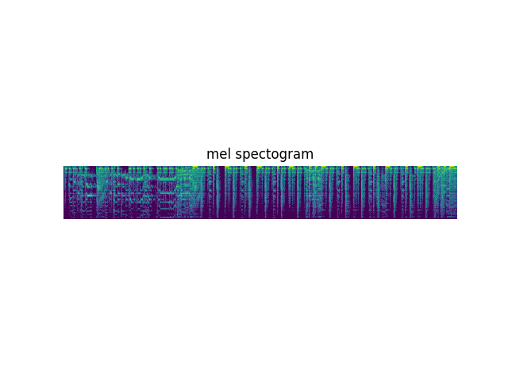
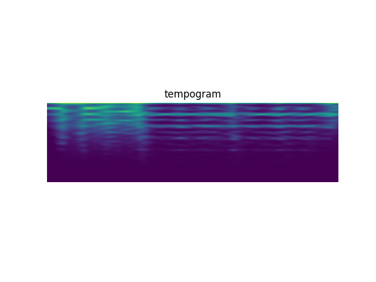
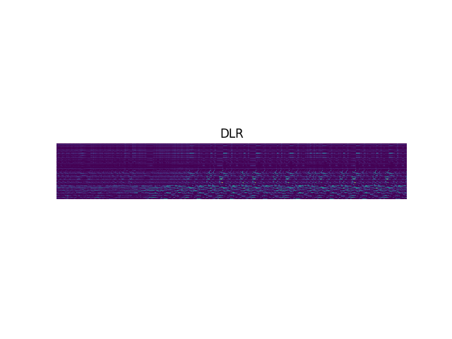

# DLR implementation
## 1. Requirements
```
matplotlib==2.1.0
librosa==0.5.1
numpy==1.13.3
tensorflow==1.3.0 or tensorflow-gpu==1.3.0
```

## 1.1 Possible Error
```
No backenderror on Ubuntu
sudo apt-get install libav-tools
```

## 2. Content
### 2.1 python files
```
config.py # basic configurations
transform.py # transform y to mel, tempo, *dlr*
models.py # models to build dlr
ops.py # tensorflow operations required on models.py
test.py # how to use
```
### 2.2 save
trained model to be restored

### 2.3 asset
test png files for mel, spec, *DLR*

## 3. Example
### 3.1 Mel spectogram


### 3.2 Tempogram


### 3.3 DLR




